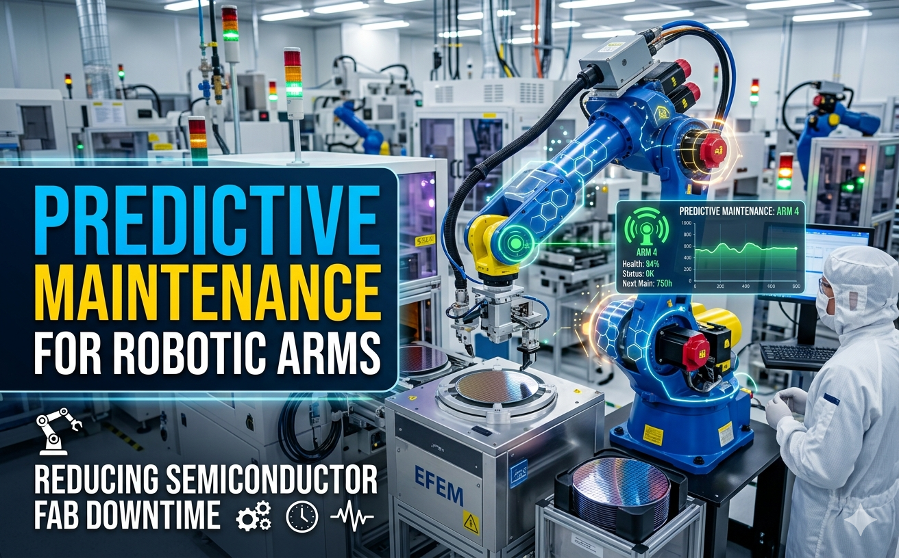

# Predictive Maintenance for Robotic Arms
## Authors: Lester Toy, Brandon Karp, and Keon Jukes

The objective of this program is to simulate how AI agents can use robotic arm temperature, current, and vibration sensor data to predict faults before they occur. Reducing downtime would help fab's save on overhead cost associated with getting robotic arms back up and running. This project is part of the Ohlone College Semiconductor Skills Bridge Academy poster presentation event.

------------------------------------------------------------------------------------------------------------

## 🏭 Fabulous Fab Observer
by Brandon Karp, Lester Toy, and Keon Jukes

[](https://react.dev/)
[](https://www.typescriptlang.org/)
[](https://vite.dev/)
[](https://tailwindcss.com/)
[](https://threejs.org/)

An advanced, high-fidelity observability dashboard designed for semiconductor fabrication facilities (Fabs) and robotic automation fleets. This platform aggregates real-time telemetric streams, manages facility registries, and features interactive 3D engineering simulators, 2D schematics, and live video feeds to ensure 24/7 operational performance and rapid anomaly detection.

---

## 🚀 Key Features

*   **📈 Fleet Health Dashboard**: Full high-density analytics overview showcasing global KPIs (Total Fleet Size, Availability Rates, Core Temperatures, Critical Alerts) and interactive status metrics powered by **Recharts**.
*   **🤖 3D Simulator & 2D Schematics**: Real-world physics simulations utilizing **Three.js** to render real-time interactive robotic arm orientations side-by-side with granular 2D wiring and positional blueprints.
*   **📡 Live Autoplay Stream Feed**: Instant toggleable "Live" stream integration displaying active robot feed telemetry, configured to autoplay and mute upon loading for lag-free visual context.
*   **⚡ Reactive Real-Time Telemetry**: Real-time mock telemetry stream demonstrating precise sensor tracking (Arm Current, Vibration Delta, and Core Temperature) paired with modular time-series data charts.
*   **📱 Universal Responsive Interface**: Crafted desktop-first with elegant drawer sidebars, mobile navigation controls, fluid bento-grid layouts, and customized typography.
*   **📁 Central Infrastructure Registry**: Fully functional CRUD management system to register new fabrication sites, sync configuration matrices, and decommission obsolete terminals.

---

## 📐 Technology Architecture

```text
├── src/
│   ├── components/
│   │   └── RobotArm3D.tsx    # Implements Interactive Three.js WebGL rendering
│   ├── App.tsx               # Primary Client routing, state containers & layouts
│   ├── constants.ts          # Physical limits, status thresholds, and defaults
│   ├── index.css             # Tailwind v4 import architecture and customized design themes
│   ├── main.tsx              # Standard Vite application root
│   └── types.ts              # Custom unified TypeScript typings (Fab, Robot, Telemetry)
├── metadata.json             # AI Studio configuration metrics
├── tsconfig.json             # TypeScript static typing strict configuration
└── vite.config.ts            # Fast build plugin configuration and server options
```

---

## 🛠️ Installation & Getting Started

### Prerequisites

*   **Node.js**: `v18.x` or subsequent LTS versions
*   **NPM**: `v9.x` or higher

### Local Development Setup

1.  **Clone the Repository**:
    ```bash
    git clone https://github.com/your-username/fabulous-fab-observer.git
    cd fabulous-fab-observer
    ```

2.  **Install Dependencies**:
    ```bash
    npm install
    ```

3.  **Run Development Server**:
    ```bash
    npm run dev
    ```

    Once initialized, browse to [http://localhost:3000](http://localhost:3000) to view your local observability dashboard.

4.  **Static Build & Optimization**:
    ```bash
    npm run build
    ```
    This bundles assets strictly inside `/dist` ready for static continuous integration (CI/CD) pipelines.

---

## 📦 Dependencies Reference

The dashboard stands on a modern, robust framework architecture:
*   Core Framework: `React 19` + `TypeScript 5`
*   Bundler: `Vite 6` with `@tailwindcss/vite`
*   3D Render Engine: `Three.js` (with standard canvas sizing observers)
*   Styles & Layout: `Tailwind CSS v4` + `Lucide React Icons`
*   Animations: `motion` (Motion for React)
*   Data Representation: `Recharts` for interactive telemetry streams

---

## 💡 Usability & Gestures

*   **Sidebar Toggle**: Click the Menu button on the top-left on smaller displays to bring up the off-canvas Facility Index.
*   **Emergency Stop**: Trigger emergency stops directly on the robot detail views to cut simulated currents and see sensor feeds enter decommission modes in real time.
*   **Live Tab**: Switch to the `Live` panel under Robot details for the custom live stream feed representing current mechanical operations.

## Test in Production

Here is the production link to test the project: https://fabmanager-semiconductor-facility-tracker-1066913899435.us-west2.run.app
